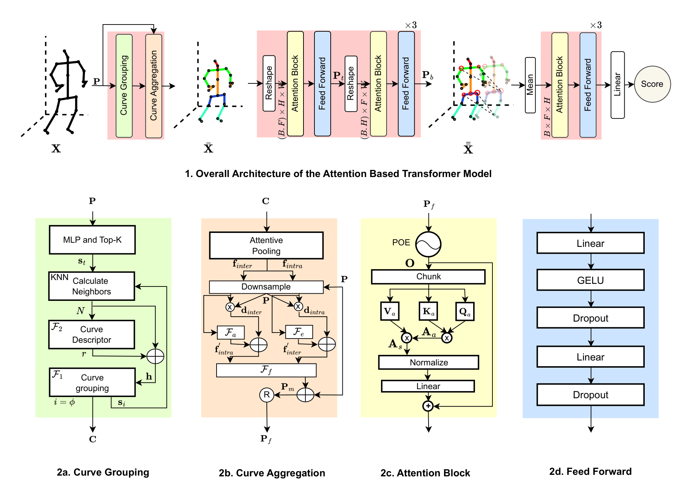
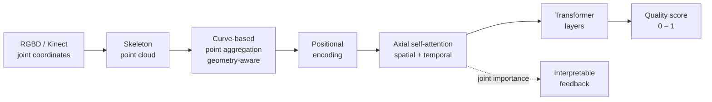

<div align="center">

# 🦾 A Point Cloud Transformer for Remote Monitoring and Automated Assessment of Physical Rehabilitation Exercises

**Geometry-aware** skeletal point clouds **+** **axial self-attention** **=** a lightweight, interpretable, real-time rehabilitation scorer.

[](https://ieeexplore.ieee.org/)
[](https://github.com/King-Rafat/Transformer_Rehabilitation)
[](https://www.python.org/)
[](https://pytorch.org/)
[](LICENSE)
[](https://github.com/King-Rafat/Transformer_Rehabilitation/stargazers)

<sub>Kazi Rafat · Md. Ismail Hossain · M M Lutfe Elahi · Sifat Momen · Fuad Rahman · Nabeel Mohammed · Shafin Rahman</sub>
<br>
<sub>North South University, Dhaka, Bangladesh · Apurba Technologies Ltd.</sub>

</div>

<p align="center">
  
</p>

---

## 📌 TL;DR

Patients do roughly **90%** of their rehab exercises at home, with no expert watching. This model scores how well an exercise is performed from skeleton data alone, so progress can be tracked remotely, cheaply, and in real time. It treats the skeleton as a **point cloud** (geometry, not a fixed graph), "walks" curves over it to enrich each joint with positional and geometric context, and uses **axial self-attention** to model space and time efficiently while highlighting the joints that matter most.

> **Three things make it different:**
>
> 🧩 **Geometric, not graph-locked** — curve-based point aggregation preserves bone lengths, directions, and structure that predefined ST-GCN graphs throw away.
>
> ⚡ **Fast and lightweight** — axial attention cuts self-attention cost; the model runs in **real time on a consumer CPU**, no GPU required.
>
> 🔍 **Interpretable** — attention coefficients reveal which joints drive the score, giving patients actionable feedback.

---

## ✨ Why this design

| Prior approach | Limitation | Our fix |
|---|---|---|
| Hand-crafted features | Expert effort, bias, misses key cues | Learned geometry-aware features |
| CNNs | Miss long-range spatio-temporal info | Transformer with axial attention |
| ST-GCNs | Fixed graph, topologically identical every frame, drops bone length/direction | Point-cloud geometry + curve aggregation |
| Full self-attention | Quadratic cost, slow | Axial attention on rearranged frames |

The curve-based aggregation uses **relative encoding** so points sitting in the same local geometry do **not** collapse to identical features (a known failure of local/non-local aggregation). Distinct points stay distinguishable, which helps the network generalize.

---

## 🏗️ Pipeline



The model accepts **variable-length sequences** with no temporal alignment or segmentation, and outputs a normalized score (0–1) representing kinematic similarity to an expert execution.

---

## 📊 Results

Evaluated on three standard benchmarks: **KIMORE**, **UI-PRMD**, and **IRDS**.

### UI-PRMD — Mean Absolute Deviation (MAD, lower is better)

| Ex | **Ours** | Mourchid | Deb | Song | Liao | Deep CNN |
|----|----------|----------|------|------|------|----------|
| 1  | **0.008** | 0.008 | 0.009 | 0.011 | 0.011 | 0.014 |
| 2  | **0.005** | 0.010 | 0.006 | 0.006 | 0.028 | 0.029 |
| 3  | **0.006** | 0.010 | 0.013 | 0.010 | 0.039 | 0.041 |
| 4  | **0.006** | 0.008 | 0.006 | 0.014 | 0.012 | 0.016 |
| 5  | **0.006** | 0.007 | 0.008 | 0.013 | 0.019 | 0.013 |
| 6  | **0.006** | 0.010 | 0.006 | 0.009 | 0.018 | 0.023 |
| 7  | **0.010** | 0.020 | 0.011 | 0.017 | 0.038 | 0.033 |
| 8  | **0.014** | 0.020 | 0.016 | 0.017 | 0.023 | 0.029 |
| 9  | **0.008** | 0.014 | 0.008 | 0.008 | 0.023 | 0.025 |
| 10 | **0.018** | 0.015 | 0.031 | 0.038 | 0.042 | 0.037 |

### KIMORE — our method, per exercise

| Metric (↓) | Ex1 | Ex2 | Ex3 | Ex4 | Ex5 |
|------------|------|------|------|------|------|
| MAD  | 0.185 | 0.560 | 0.128 | 0.256 | 0.388 |
| RMSE | 0.591 | 1.235 | 0.233 | 0.451 | 0.678 |
| MAPE | 0.543 | 1.891 | 0.336 | 0.766 | 1.199 |

### IRDS — accuracy (higher is better)

| Model | **Ours** | Zheng (Baseline) | Zheng (R.I.) | Zhang | Li |
|-------|----------|------------------|--------------|-------|-----|
| Mean accuracy | **0.9819** | 0.9751 | 0.9741 | 0.9680 | 0.9720 |

### ⚡ Efficiency — inference time on KIMORE Ex5 test set (75 instances / 7,500 frames)

| Model | GPU time (s) | CPU time (s) |
|-------|--------------|--------------|
| STGCN | 13.52 | 85.68 |
| D-STGCNT | 2.05 | 23.47 |
| **Ours** | **1.09** | **10.08** |

**~12.4× faster** than the STGCN baseline on GPU. On CPU that is **~1.34 ms/frame** (~134 ms per exercise video), well under the 33.3 ms/frame budget at 30 fps, so it sustains real-time throughput with **~25× headroom and no specialised hardware**. On an RTX 3070 Ti it drops to **~0.15 ms/frame**.

### 📡 Remote-monitoring footprint

Transmits only skeletal coordinates (25 joints × 3 × 4 bytes = **300 bytes/frame**), so the stream is **~72 kbps**, with an estimated **~50–70 ms** end-to-end latency. Easily fits a typical home broadband uplink.

---

### 📡 Remote-monitoring footprint
 
Transmits only skeletal coordinates (25 joints × 3 × 4 bytes = **300 bytes/frame**), so the stream is **~72 kbps**, with an estimated **~50–70 ms** end-to-end latency. Easily fits a typical home broadband uplink.
 
---
 
## 📁 Repository structure
 
```
Transformer_Rehabilitation/
├── train.py               # entrypoint: train on one exercise
├── eval.py                # entrypoint: evaluate a checkpoint (MAD/RMSE/MSE/MAPE)
├── config.py              # YAML + CLI argument loader
├── configs/
│   └── default.yaml       # all hyperparameters and paths
├── models/                # network definition
│   ├── temporal_model.py  #   TemporalModel (CurveNet encoder + axial transformer)
│   ├── transformer.py     #   axial self-attention blocks
│   └── embedder.py        #   Fourier positional embedder
├── data/
│   └── datasets.py        # KIMORE + UI-PRMD loaders -> DataLoaders
├── engine/
│   ├── trainer.py         # training loop
│   └── evaluator.py       # metric computation
├── utils/
│   ├── metrics.py         # MAD, RMSE, MSE, MAPE
│   └── seed.py            # reproducibility
├── core/                  # CurveNet — curve-based point aggregation
├── Data_Proc/             # KIMORE preprocessing (Data_Loader)
├── Images/                # figures & diagrams
├── Rehabilitation.ipynb   # original all-in-one notebook 
├── Rehab_T-SNE.ipynb      # t-SNE visualization of learned embeddings
├── requirements.txt
└── README.md
```
 
---
 
## 🚀 Getting started
 
### Dependencies
 
```bash
python >= 3.7
pytorch  +  cudatoolkit >= 11.2   # may work on lower
```
 
```bash
git clone https://github.com/King-Rafat/Transformer_Rehabilitation.git
cd Transformer_Rehabilitation
pip install torch numpy scipy scikit-learn matplotlib jupyter
```
### Smoke Test
```bash
pip install -r requirements.txt

python -c "import train, eval, models, data, engine, utils; print('imports ok')"

python train.py --ex Kimore_ex5 --epoch 2

python eval.py --ex Kimore_ex5 --checkpoint checkpoints/Kimore_ex5.pt
```

### Train
 
All settings live in `configs/default.yaml`; override any of them on the command line.
 
```bash
# Train on KIMORE exercise 5 (writes checkpoints/Kimore_ex5.pt)
python train.py --config configs/default.yaml --ex Kimore_ex5 --epoch 2000
 
# Train on a UI-PRMD exercise
python train.py --config configs/default.yaml --ex UI_ex1 --epoch 2000 --lr 0.0001
```
 
The best checkpoint (lowest validation MAD) is saved to `--save_dir` (default `./checkpoints/`) as `<ex>.pt`.
 
### Evaluate
 
```bash
# Evaluate a trained checkpoint -> prints MAD / RMSE / MSE / MAPE
python eval.py --config configs/default.yaml --ex Kimore_ex5 \
    --checkpoint checkpoints/Kimore_ex5.pt
```


### Configuration
 
| Field | Meaning | Default |
|-------|---------|---------|
| `ex` | exercise/dataset (`Kimore_ex1..5`, `UI_ex1..10`) | `Kimore_ex5` |
| `lr` | learning rate | `0.0001` |
| `epoch` | training epochs | `2000` |
| `batch_size` | batch size | `1` |
| `save_dir` | where checkpoints are written | `./checkpoints` |
| `checkpoint` | weights loaded by `eval.py` | `./checkpoints/Kimore_ex5.pt` |
 
> The original all-in-one `Rehabilitation.ipynb` is kept for reference and for the
> interpretability / t-SNE plots (`Rehab_T-SNE.ipynb`).
 
---

## 🚀 Getting started

### Dependencies

```bash
python >= 3.7
pytorch  +  cudatoolkit >= 11.2   # may work on lower
```

```bash
git clone https://github.com/King-Rafat/Transformer_Rehabilitation.git
cd Transformer_Rehabilitation
pip install torch numpy scipy scikit-learn matplotlib jupyter
```

### Datasets

| Dataset | Joints | Sensor | Task | Official source | Processed splits |
|---------|--------|--------|------|-----------------|------------------|
| **KIMORE** | 25 | Kinect v2 | Quality score (regression) | [Data](https://pubmed.ncbi.nlm.nih.gov/31217121/) | _TODO: add link_ |
| **UI-PRMD** | 39 | Vicon / Kinect | Quality score (regression) | [Data](https://github.com/avakanski/A-Deep-Learning-Framework-for-Assessing-Physical-Rehabilitation-Exercises) | _TODO: add link_ |
| **IRDS** | 29 | Kinect v2 | Correct / incorrect (classification) | [MDPI Data](https://www.mdpi.com/2306-5729/6/5/46) | _TODO: add link_ |

Download each dataset from the official source above and point the loaders in `Data_Proc/` to your local paths. The exact train/val/test splits used in the paper can be downloaded from the **Processed splits** column (drop in a Google Drive / Hugging Face / Zenodo link once uploaded).

### 💾 Pretrained checkpoints

All pretrained weights (KIMORE, UI-PRMD, IRDS) are available here:

**➡️ [Download checkpoints (Kimore)](https://drive.google.com/drive/folders/12CEkE6Z0dYunCl7B6ug7lAQKW-eIY43S?usp=sharing)**
**➡️ [Download checkpoints (UI-PRMD)](https://drive.google.com/drive/folders/1OYHRXdKbRFrz_n0ftXFQwaHr4KAMT7xd?usp=sharing)**
Download and place them under `checkpoints/`.

### Run

Open the main notebook and run the cells end to end:

```bash
jupyter notebook Rehabilitation.ipynb
```

It contains the model architecture, the training loop, inference, validation, and the visualizations. Use `Rehab_T-SNE.ipynb` to reproduce the embedding clusters (accurate / moderate / inaccurate).

---

## 🙏 Acknowledgements

This work builds on several open repositories:

- Curve-based point aggregation: [CurveNet](https://github.com/tiangexiang/CurveNet)
- Loading KIMORE: [KiMoRe_wrapper](https://github.com/petteriTeikari/KiMoRe_wrapper)
- Processing KIMORE: [STGCN-rehab](https://github.com/fokhruli/STGCN-rehab)
- Loading & processing UI-PRMD: [A-Deep-Learning-Framework](https://github.com/avakanski/A-Deep-Learning-Framework-for-Assessing-Physical-Rehabilitation-Exercises)

---


---

<div align="center">
<sub>Maintained by <a href="https://github.com/King-Rafat">King-Rafat</a> · Questions? Open an <a href="https://github.com/King-Rafat/Transformer_Rehabilitation/issues">issue</a>.</sub>
</div>
